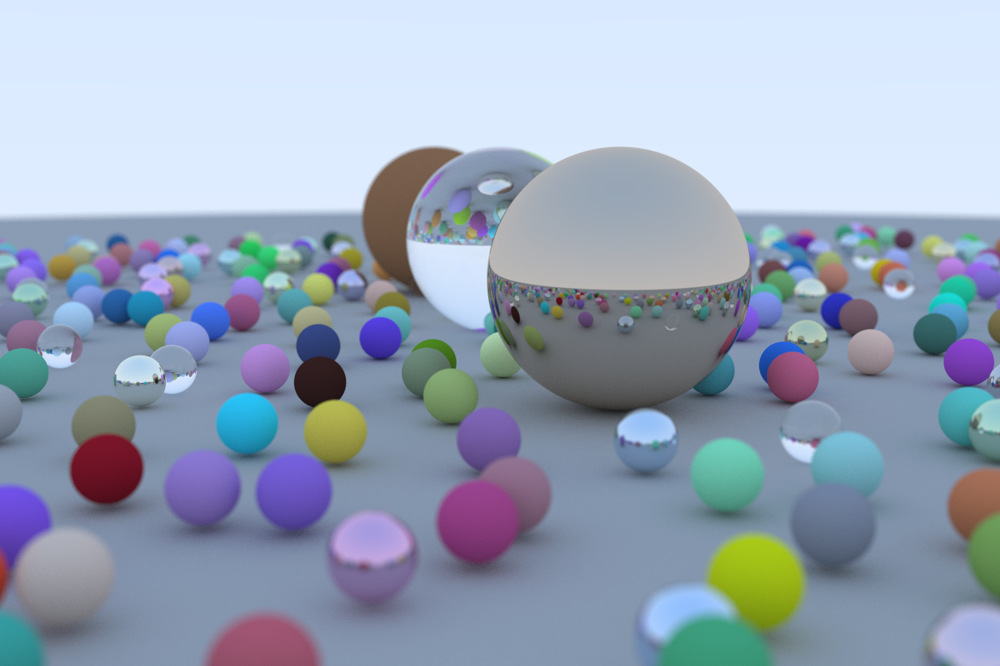

https://graphics.stanford.edu/courses/cs148-10-summer/docs/2006--degreve--reflection_refraction.pdf

### "A Final Render"

When rendering the book cover at 1200x800 resolution, it took 5 minutes to reach 500 samples
when multithreading on an M1 Macbook Pro (8 cores), approximately 0.6 seconds per frame. Without multithreading,
each frame took 3.5 seconds, a 6-fold slowdown.
